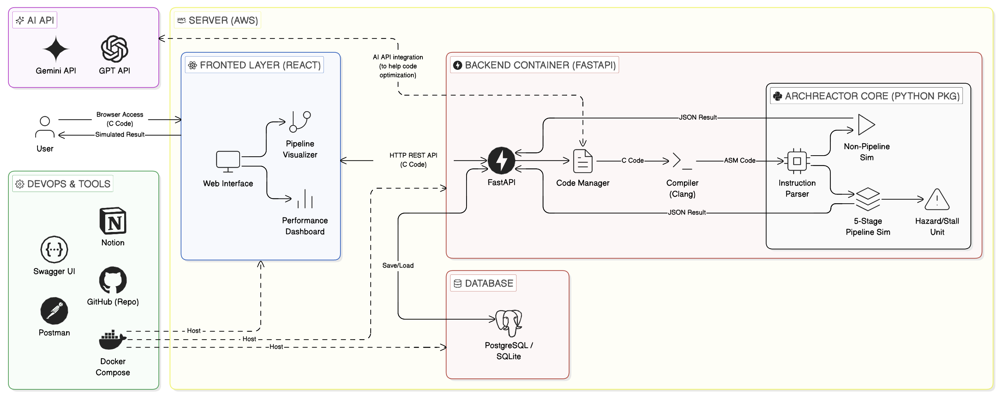

# ArchReactor: An Educational RISC-V Architecture Simulator for Computer Engineering Freshmen

**ArchReactor** is an educational RISC-V architecture simulation platform  
designed for computer engineering freshmen.

This project helps students understand how instructions are executed  
inside a CPU, step by step and cycle by cycle.

---

## Architecture Overview



---

## Motivation

Many computer engineering students find it difficult to understand:

- How C or assembly code is executed inside a CPU
- How instructions move through pipeline stages
- Why similar code can have different execution times

ArchReactor was created to visualize these processes clearly  
and help students learn computer architecture more intuitively.

---

## Key Features

- RISC-V (RV32I) instruction simulation
- Pipeline visualization (IF, ID, EX, MEM, WB)
- Cycle-by-cycle execution view
- Register and memory state tracking
- Stall, forwarding, and flush explanation
- Code saving and reloading
- Execution statistics (cycles, CPI)

*(C language support and AI-based optimization advice are planned features.)*

---

## System Architecture

ArchReactor is built with three main components:

- **Core (Python)**  
  - RISC-V instruction execution logic  
  - Pipeline and hazard simulation  

- **Backend (FastAPI)**  
  - API server  
  - Code and execution history management  
  - Core integration  

- **Frontend (React)**  
  - Code editor  
  - Pipeline and state visualization  

---

## Target Users

- Computer Engineering freshmen
- Students learning computer architecture
- Anyone interested in how code runs on hardware

---

## How to Run (Development)

### Frontend
```bash
cd frontend
npm install
npm run dev
